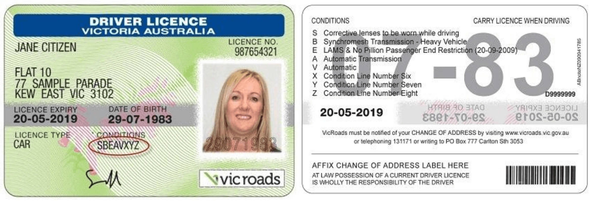
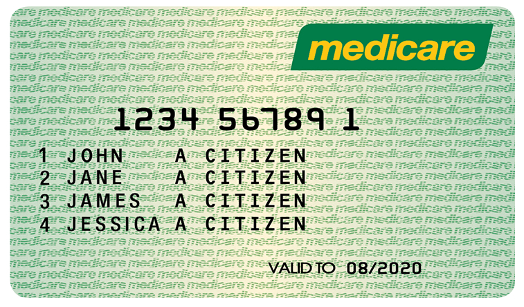
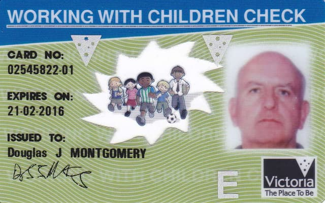
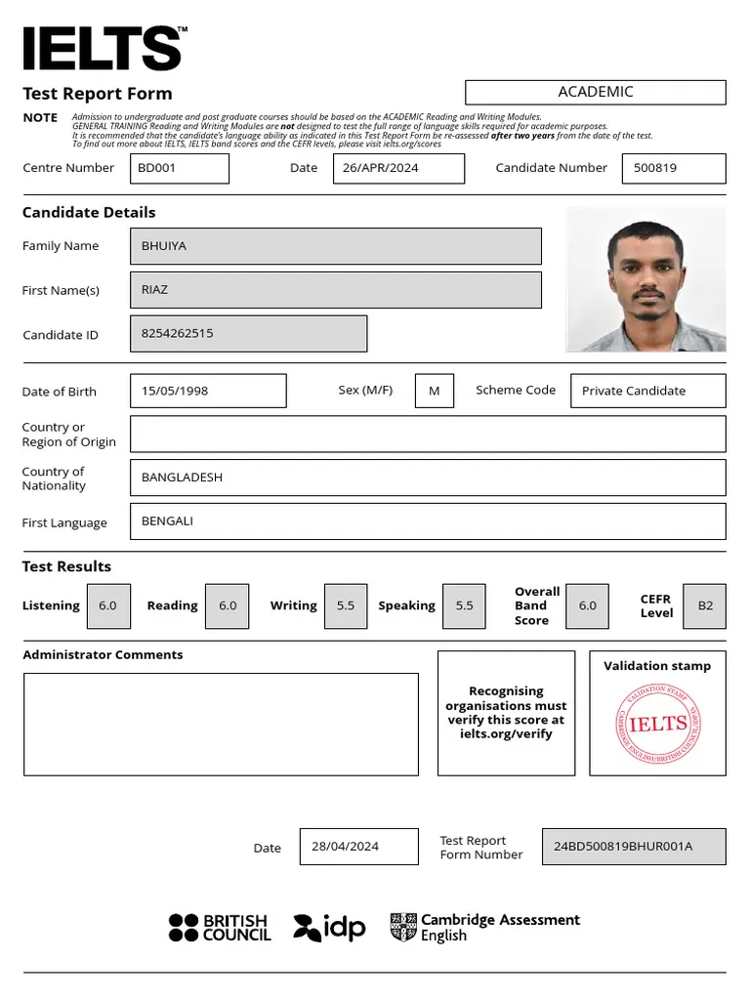
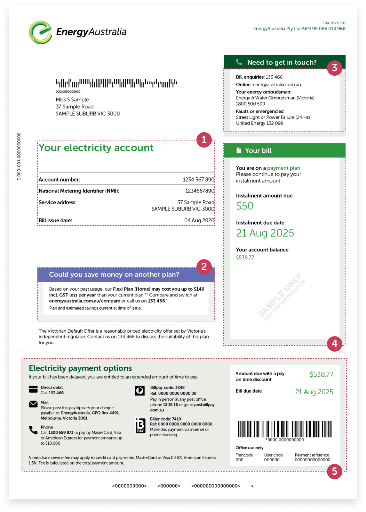

# Production-Ready OCR & Document Understanding Mastery Challenge

# Step 2: Define Supported Documents & Extraction Schemas

---

# Overview

Research/Learn: JSON schema design for each document type, handling
variations (different states/countries, formats).
Actions: Create formal JSON schemas for all supported documents.
Milestone: Complete schema library + “unknown” fallback logic documented.

---

# Table of Contents

- [1. Parent Response Schema](#1-parent-response-schema)
- [2. Standard Image Fields](#2-standard-image-fields)
- [3. Supported Documents](#3-supported-documents)
  - [3.1 Passport](#31-passport)
  - [3.2 Driver Licence](#32-driver-licence)
  - [3.3 Medicare Card](#33-medicare-card)
  - [3.4 Working With Children (WWC)](#34-working-with-children-wwc)
  - [3.5 IELTS Certificate](#35-ielts-certificate)
  - [3.6 Energy Bill](#36-energy-bill)
  - [3.7 Unknown Document](#37-unknown-document)

---

# 1. Parent Response Schema

## Purpose

All OCR outputs must follow a shared parent schema.

This provides:
- unified API responses
- easier frontend rendering
- centralized error handling
- scalable document support
- easier monitoring and debugging
- simplified downstream processing

The `data` field contains the extracted fields for the detected document type.

---

# Parent Response Schema

```json
{
  "type": "object",
  "title": "OCR Parent Response",
  "description": "Standard response structure for all OCR document extraction outputs",
  "properties": {
    "status": {
      "type": "string",
      "enum": ["success", "partial", "failed", "unknown"],
      "title": "Processing Status",
      "description": "Overall extraction status returned by the OCR pipeline",
      "required": true
    },

    "doc_type": {
      "type": "string",
      "title": "Document Type",
      "description": "Detected document classification label",
      "required": true
    },

    "confidence": {
      "type": "number",
      "minimum": 0.0,
      "maximum": 1.0,
      "title": "Classification Confidence",
      "description": "Confidence score returned by the document classifier",
      "required": false
    },

    "message": {
      "type": "string",
      "title": "Processing Message",
      "description": "Optional informational message returned during processing",
      "required": false
    },

    "error": {
      "type": ["string", "null"],
      "title": "Error Detail",
      "description": "Detailed error message when extraction fails",
      "required": false
    },

    "data": {
      "type": ["object", "null"],
      "title": "Extracted Data",
      "description": "Structured extracted fields based on the detected document schema",
      "required": true
    }
  }
}
```

---

# 2. Standard Image Fields

## Purpose

To maintain consistency across all document schemas, every document must use the same image field structure.

These fields store image references, uploaded image paths, cloud storage URLs, or base64 image data depending on system architecture.

---

# Standard Image Field Schema

```json
{
  "document_front": {
    "type": "array",
    "title": "Document Front Photo",
    "description": "Image the front side of the document",
    "items": {
      "type": "string",
      "description": "Image path, URL, or base64 string"
    },
    "required": true
  },

  "document_back": {
    "type": "array",
    "title": "Document Back Photo",
    "description": "Image the back side of the document",
    "items": {
      "type": "string",
      "description": "Image path, URL, or base64 string"
    },
    "required": false
  }
}
```

---

# 3. Supported Documents

---

# 3.1 Passport

## Description

A passport is an official government-issued international travel and identity document.

Passports are commonly used for:
- identity verification
- international travel
- visa applications
- KYC verification
- onboarding workflows

The OCR system should prioritize high-confidence extraction of identity fields and MRZ information.

---

## Important Extraction Fields

- first name
- middle name
- last name
- passport number
- nationality
- gender
- date of birth
- expiry date
- place of birth
- MRZ lines

---


## Passport Schema

```json
{
  "$schema": "http://json-schema.org/draft-07/schema#",
  "title": "Australian Passport",
  "type": "object",
  "properties": {
    "document_type": {
      "type": "string",
      "title": "Document Type",
      "description": "Always AUS_PASSPORT",
      "required": true
    },
    "australian_passport_number": {
      "type": "string",
      "title": "Passport Number",
      "description": "Document number as shown in the top-right of the Australian passport data page (e.g. RA0123456)",
      "required": true
    },
    "australian_passport_last_name": {
      "type": "string",
      "title": "Last Name",
      "description": "Family name / surname as shown on passport",
      "required": true
    },
    "australian_passport_first_name": {
      "type": "string",
      "title": "First Name",
      "description": "Given name/Fi as shown on the Australian passpor",
      "required": true
    },
    "australian_passport_middle_name": {
      "type": [
        "string",
        "null"
      ],
      "title": "Middle Name",
      "description": "Middle name as shown on passport",
      "required": false
    },
    "australian_passport_date_of_birth": {
      "type": "string",
      "title": "Date of Birth",
      "description": "Date of birth as shown on the Australian passport data page",
      "required": true
    },
    "australian_passport_date_of_issue": {
      "type": "string",
      "title": "Date of Issue",
      "description": "Date of issue as shown on the Australian passport data page",
      "required": true
    },
    "australian_passport_expiry_date": {
      "type": "string",
      "title": "Expiry Date",
      "description": "Date of expiry as shown on the Australian passport data page",
      "required": true
    },
    "australian_passport_nationality": {
      "type": "string",
      "title": "Nationality",
      "description": "Nationality as shown on the passport data page (e.g. AUSTRALIAN)",
      "required": true
    },
    "australian_passport_gender": {
      "type": "string",
      "title": "Gender",
      "description": "Sex as shown on the Australian passport data page (M, F or X)",
      "required": true
    },
    "australian_passport_place_of_birth": {
      "type": "string",
      "title": "Place of Birth",
      "description": "Place of birth as shown on the Australian passport data page (e.g. CANBERRA)",
      "required": true
    },
    "australian_passport_authority": {
      "type": [
        "string",
        "null"
      ],
      "title": "Issuing Authority",
      "description": "Issuing authority as shown on the Australian passport data page (e.g. CANBERRA)",
      "required": true
    },
    "australian_passport_mrz_line1": {
      "type": "string",
      "title": "MRZ Line 1",
      "description": "Machine readable zone line 1",
      "maxLength": 44,
      "minLength": 44,
      "required": true
    },
    "australian_passport_mrz_line2": {
      "type": "string",
      "title": "MRZ Line 2",
      "description": "Machine readable zone line 2",
      "maxLength": 44,
      "minLength": 44,
      "required": true
    },
    "commencement_document_front": {
      "type": "array",
      "title": "Document Front Photo",
      "description": "Photo of the Australian passport data page",
      "required": true
    },
    "commencement_document_back": {
      "type": "array",
      "title": "Document Back Photo",
      "description": "Photo of the Australian passport observations page",
      "required": false
    }
  }
}
```

---

# 3.2 Driver Licence

## Description

An official government-issued licence allowing a person to legally operate vehicles.

Driver licences are widely used for:
- identity verification
- age verification
- onboarding systems
- address verification
- KYC workflows

Optional low-value OCR fields may be excluded during MVP implementation to simplify extraction complexity.

---

## Important Extraction Fields

- licence holder name
- licence number
- date of birth
- expiry date
- issuing state
- residential address

---



## Driver Licence Schema

```json
{
    "$schema": "http://json-schema.org/draft-07/schema#",
    "title": "Australian Driver's Licence",
    "type": "object",
    "properties": {
        "document_type": {
            "type": "string",
            "title": "Document Type",
            "description": "Always AUS_DRIVER_LICENSE",
            "required": true
            },
        "australian_driver_license_first_name": {
            "type": "string",
            "title": "First Name",
            "description": "First name as shown on the driver's licence (e.g., 'JANE')",
            "required": true
        },
        "australian_driver_license_middle_name": {
            "type": ["string", "null"],
            "title": "Middle Name",
            "description": "Middle name as shown on the driver's licence (e.g., 'LEE')",
            "required": false
        },
        "australian_driver_license_last_name": {
            "type": "string",
            "title": "Last Name",
            "description": "Last name as shown on the driver's licence (e.g., 'CITIZEN')",
            "required": true
        },
        "australian_driver_license_address": {
            "type": "string",
            "title": "Address",
            "description": "Full residential address as shown on the driver's licence",
            "required": true
        },
        "australian_driver_license_licence_number": {
            "type": "string",
            "title": "Licence Number",
            "description": "Licence number as shown on the front of the driver's licence (e.g., '987654321')",
            "required": true
        },
        "australian_driver_license_state": {
            "type": "string",
            "title": "State of Issue",
            "description": "Australian state or territory that issued the driver's licence (e.g., 'VIC')",
            "required": true
        },
        "australian_driver_license_card_number": {
            "type": "string",
            "title": "Card Number",
            "description": "Card number printed on the back of the driver's licence (e.g., 'D9999999')",
            "required": true
        },
        "australian_driver_license_class": {
            "type": "string",
            "title": "Class",
            "description": "Licence class as shown on the driver's licence (e.g., 'CAR')",
            "required": true
        },
        "australian_driver_license_expiry_date": {
            "type": "string",
            "title": "Licence Expiry",
            "description": "Licence expiry date as shown on the front of the driver's licence (e.g., '2019-05-20')",
            "required": true
        },
        "australian_driver_license_dob": {
            "type": "string",
            "title": "Date of Birth",
            "description": "Date of birth as shown on the front of the driver's licence (e.g., '1983-07-29')",
            "required": true
        }
    }
}
```

---

# 3.3 Medicare Card

## Description

Healthcare identification card used for accessing Medicare services.

Medicare cards are commonly used for:
- healthcare verification
- identity validation
- government service onboarding

Non-essential appearance-related fields can be removed to reduce OCR complexity.

---

## Important Extraction Fields

- card number
- holder name
- expiry date
- individual reference position

---




## Medicare Card Schema

```json
{
  "$schema": "http://json-schema.org/draft-07/schema#",
  "title": "Medicare Card",
  "type": "object",
  "properties": {
    "document_type": {
      "type": "string",
      "title": "Document Type",
      "description": "Always AUS_MEDICARE_CARD",
      "required": true
    },
    "medicare_card_type": {
      "type": "string",
      "title": "Card Type",
      "description": "regular | interim card | reciprocal health care",
      "enum": [
        "regular",
        "interim card",
        "reciprocal health care"
      ],
      "required": true
    },
    "medicare_card_number": {
      "type": "string",
      "title": "Card Number",
      "description": "10-digit card number as shown on the front of the Medicare card e.g. 1234 56789 1",
      "required": true
    },
    "cardholders": {
      "type": "array",
      "title": "Cardholders",
      "description": "1 to 5 cardholders listed on the card",
      "required": true,
      "minItems": 1,
      "maxItems": 5,
      "items": {
        "type": "object",
        "properties": {
          "position": {
            "type": "integer",
            "title": "Position",
            "description": "Single digit position number shown to the left of the name on the Medicare card (e.g. 1)",
            "required": true
          },
          "first_name": {
            "type": "string",
            "title": "First Name",
            "description": "First name/Given name as shown on the name line of the Medicare card",
            "required": true
          },
          "middle_initial": {
            "type": [
              "string",
              "null"
            ],
            "title": "Middle Initial",
            "description": "Middle name or initial as shown on the name line of the Medicare card (may appear as a single initial e.g. A)",
            "required": false
          },
          "last_name": {
            "type": "string",
            "title": "Last Name",
            "description": "Last name/Family name/Surname as shown on the name line of the Medicare card",
            "required": true
          },
          "full_name": {
            "type": "string",
            "title": "Full Name",
            "description": "Full name as shown on the name line of the Medicare card, position + first name + middle initial + last name (e.g. 1 JOHN A SMITH)",
            "required": true
          }
        }
      }
    },
    "medicare_card_expiry_date": {
      "type": "string",
      "title": "Expiry Date",
      "description": "Expiry month and year as shown on the Medicare card (MM/YYYY or DD/MM/YYYY)",
      "required": true
    },
    "secondary_document_front": {
      "type": "array",
      "title": "Document Front Photo",
      "description": "Photo of the front of the Medicare card",
      "required": true
    },
    "secondary_document_back": {
      "type": "array",
      "title": "Document Back Photo",
      "description": "Photo of the back of the Medicare card",
      "required": false
    }
  }
}
```

---

# 3.4 Working With Children (WWC)

## Description

A Working With Children (WWC) card is a government-issued background-check clearance document.

It is commonly required for:
- education roles
- childcare positions
- volunteer programs
- regulated employment

---

## Important Extraction Fields

- holder name
- WWC card number
- expiry date
- issuing state

---




## WWC Schema

```json
{
  "$schema": "http://json-schema.org/draft-07/schema#",
  "title": "Victoria Working With Children Check Card",
  "description": "Victoria WWC card",
  "type": "object",
  "properties": {
    "document_type": {
      "type": "string",
      "title": "Document Type",
      "description": "Always AUS_WWC_CARD",
      "required": true
    },
    "wwc_first_name": {
      "type": "string",
      "title": "First Name",
      "description": "First and middle names of the cardholder",
      "required": true
    },
    "wwc_last_name": {
      "type": "string",
      "title": "Last Name",
      "description": "Last name of the cardholder",
      "required": true
    },
    "wwc_card_number": {
      "type": "string",
      "title": "Card Number",
      "description": "WWC card identification number",
      "required": true
    },
    "wwc_expiry_date": {
      "type": "string",
      "title": "Expiry Date",
      "description": "Expiration date of the card (Format: DD-MM-YYYY)",
      "required": true
    },
    "wwc_type": {
      "type": "string",
      "title": "Card Type",
      "description": "Card classification (EMPLOYEE or VOLUNTEER)",
      "required": true
    },
    "wwc_issuing_state": {
      "type": "string",
      "title": "State",
      "description": "Issuing state of the card",
      "required": true
    }
  }
}
```

---

# 3.5 IELTS Certificate

## Description

An IELTS Test Report Form (TRF) is an official English proficiency certificate.

It is commonly used for:
- university applications
- migration
- employment verification
- visa applications

Detailed subsection scores may optionally be extracted in later versions.

---

## Important Extraction Fields
- centre Number
- candidate Number
- candidate ID
- name
- date of Birth
- nationality
- first Language
- individual skill scores
- CEFR level
- validation stamp
- cheme code
- report form number

---


## IELTS Schema

```json
{
  "title": "IELTS Test Report Form",
  "description": "Production-ready extraction schema for IELTS certificates",
  "type": "object",

  "properties": {

    "ielts_candidate_first_name": {
      "type": "string",
      "title": "Candidate First Name",
      "description": "Candidate given name(s)",
      "required": true
    },

    "ielts_candidate_last_name": {
      "type": "string",
      "title": "Candidate Last Name",
      "description": "Candidate family name",
      "required": true
    },

    "ielts_candidate_id": {
      "type": ["string", "null"],
      "title": "Candidate ID",
      "description": "Candidate identification number shown on certificate",
      "required": false
    },

    "ielts_candidate_number": {
      "type": ["string", "null"],
      "title": "Candidate Number",
      "description": "Internal IELTS candidate number",
      "required": false
    },

    "ielts_centre_number": {
      "type": ["string", "null"],
      "title": "Centre Number",
      "description": "IELTS testing centre number",
      "required": false
    },

    "ielts_test_date": {
      "type": "string",
      "format": "date",
      "title": "Test Date",
      "description": "Official IELTS examination date",
      "required": true
    },

    "ielts_report_date": {
      "type": ["string", "null"],
      "format": "date",
      "title": "Report Issue Date",
      "description": "Date the report form was issued",
      "required": false
    },

    "ielts_date_of_birth": {
      "type": ["string", "null"],
      "format": "date",
      "title": "Date of Birth",
      "description": "Candidate birth date",
      "required": false
    },

    "ielts_gender": {
      "type": ["string", "null"],
      "enum": ["M", "F", "Other", null],
      "title": "Gender",
      "description": "Candidate gender",
      "required": false
    },

    "ielts_country_of_nationality": {
      "type": ["string", "null"],
      "title": "Country of Nationality",
      "description": "Candidate nationality",
      "required": false
    },

    "ielts_first_language": {
      "type": ["string", "null"],
      "title": "First Language",
      "description": "Candidate first language",
      "required": false
    },

    "ielts_test_type": {
      "type": "string",
      "enum": [
        "Academic",
        "General Training",
        "UKVI Academic",
        "UKVI General Training",
        "Life Skills",
        "Unknown"
      ],
      "title": "Test Type",
      "description": "IELTS examination type",
      "required": true
    },

    "ielts_scheme_code": {
      "type": ["string", "null"],
      "title": "Scheme Code",
      "description": "IELTS scheme or registration category",
      "required": false
    },

    "ielts_listening_score": {
      "type": ["number", "null"],
      "minimum": 0,
      "maximum": 9,
      "title": "Listening Score",
      "description": "IELTS listening band score",
      "required": false
    },

    "ielts_reading_score": {
      "type": ["number", "null"],
      "minimum": 0,
      "maximum": 9,
      "title": "Reading Score",
      "description": "IELTS reading band score",
      "required": false
    },

    "ielts_writing_score": {
      "type": ["number", "null"],
      "minimum": 0,
      "maximum": 9,
      "title": "Writing Score",
      "description": "IELTS writing band score",
      "required": false
    },

    "ielts_speaking_score": {
      "type": ["number", "null"],
      "minimum": 0,
      "maximum": 9,
      "title": "Speaking Score",
      "description": "IELTS speaking band score",
      "required": false
    },

    "ielts_overall_band_score": {
      "type": "number",
      "minimum": 0,
      "maximum": 9,
      "title": "Overall Band Score",
      "description": "Overall IELTS band score",
      "required": true
    },

    "ielts_cefr_level": {
      "type": ["string", "null"],
      "title": "CEFR Level",
      "description": "Mapped CEFR proficiency level",
      "required": false
    },

    "ielts_trf_number": {
      "type": "string",
      "title": "TRF Number",
      "description": "Unique IELTS Test Report Form number",
      "required": true
    },

    "ielts_administrator_comments": {
      "type": ["string", "null"],
      "title": "Administrator Comments",
      "description": "Optional comments section",
      "required": false
    },

    "ielts_has_validation_stamp": {
      "type": ["boolean", "null"],
      "title": "Validation Stamp Present",
      "description": "Whether validation stamp exists",
      "required": false
    },

    "ielts_candidate_photo_present": {
      "type": ["boolean", "null"],
      "title": "Candidate Photo Present",
      "description": "Whether candidate photo is detected",
      "required": false
    },

    "document_front": {
      "type": "array",
      "title": "IELTS Front Image",
      "description": "Front side image of IELTS certificate",
      "items": {
        "type": "string"
      },
      "required": true
    },

    "document_back": {
      "type": "array",
      "title": "IELTS Back Image",
      "description": "Back side image of IELTS certificate",
      "items": {
        "type": "string"
      },
      "required": false
    }
  }
}
```

---

# 3.6 Energy Bill

## Description

An energy bill is a utility document issued by an electricity or gas retailer.

Energy bills are commonly used for:
- proof of address
- customer verification
- utility account validation
- billing verification
- payment reconciliation
- onboarding and KYC workflows

Australian energy bills may contain:
- account information
- service address
- billing period
- payment details
- utility identifiers
- usage summaries
- tax information
- barcode and BPAY references

Different providers use different layouts and terminology, so OCR extraction should support flexible optional fields.

---

## Important Extraction Fields

### Core Identity Fields

- provider name
- account holder name
- account number
- service address

### Billing Fields

- issue date
- due date
- billing period
- total amount due
- account balance

### Utility Identifiers

- NMI
- MIRN
- meter number

### Payment Fields

- BPAY code
- BPAY reference
- payment reference
- payment plan indicator

### Consumption Fields

- electricity usage (kWh)
- gas usage (MJ)
- supply charge
- usage charge

---

## OCR Extraction Notes

### Required Fields

The following fields are considered high-priority and should normally be extracted:

- provider name
- account holder name
- account number
- service address
- due date
- total amount due

### Optional Fields

Many energy bill layouts vary significantly between providers.

Optional fields may be:
- missing
- renamed
- positioned differently
- unavailable on some bill types

Because of this:
- non-critical fields should remain optional
- OCR failures should not invalidate the entire extraction

---



## Energy Bill Schema

```json
{
  "$schema": "http://json-schema.org/draft-07/schema#",
  "title": "Australian Energy Bill",
  "type": "object",
  "properties": {

    "document_type": {
      "type": "string",
      "title": "Document Type",
      "description": "Always AUS_ELECTRICITY_BILL.",
      "enum": ["AUS_ELECTRICITY_BILL"],
      "required": true
    },

    "provider_name": {
      "type": "string",
      "title": "Provider Name",
      "description": "Trading name of the energy retailer as shown on the bill (e.g. 'AGL', 'EnergyAustralia').",
      "required": true
    },

    "provider_abn": {
      "type": ["string", "null"],
      "title": "Provider ABN",
      "description": "Australian Business Number of the energy retailer (e.g. '11 222 333 444').",
      "required": false
    },

    "account_holder_name": {
      "type": "string",
      "title": "Account Holder Name",
      "description": "Full name of the account holder as shown on the bill (e.g. 'Jane Citizen').",
      "required": true
    },

    "account_number": {
      "type": ["string", "null"],
      "title": "Account Number",
      "description": "Customer account number as shown on the bill (e.g. '123456').",
      "required": false
    },

    "nmi": {
      "type": ["string", "null"],
      "title": "National Metering Identifier (NMI)",
      "description": "10-digit electricity meter identifier (e.g. '0123456789'). Electricity only.",
      "required": false
    },

    "mirn": {
      "type": ["string", "null"],
      "title": "Meter Installation Reference Number (MIRN)",
      "description": "Gas meter identifier assigned to the supply point. Gas or dual only.",
      "required": false
    },

    "service_address_street": {
      "type": "string",
      "title": "Service Address - Street",
      "description": "Street number and name of the supply address (e.g. '1 Street Road').",
      "required": true
    },

    "service_address_suburb": {
      "type": "string",
      "title": "Service Address - Suburb",
      "description": "Suburb or locality of the supply address (e.g. 'ANYTOWN').",
      "required": true
    },

    "service_address_state": {
      "type": "string",
      "title": "Service Address - State",
      "description": "Australian state or territory abbreviation (e.g. 'VIC').",
      "enum": ["NSW", "VIC", "QLD", "WA", "SA", "TAS", "ACT", "NT"],
      "required": true
    },

    "service_address_postcode": {
      "type": "string",
      "title": "Service Address - Postcode",
      "description": "4-digit Australian postcode (e.g. '0000').",
      "required": true
    },

    "bill_issue_date": {
      "type": ["string", "null"],
      "title": "Bill Issue Date",
      "description": "Date the bill was issued (YYYY-MM-DD) (e.g. '2022-04-01').",
      "format": "date",
      "required": false
    },

    "bill_due_date": {
      "type": ["string", "null"],
      "title": "Bill Due Date",
      "description": "Payment due date (YYYY-MM-DD) (e.g. '2022-04-27').",
      "format": "date",
      "required": false
    },

    "billing_period_start": {
      "type": "string",
      "title": "Billing Period Start",
      "description": "Start date of the billing period (YYYY-MM-DD) (e.g. '2022-03-01').",
      "format": "date",
      "required": true
    },

    "billing_period_end": {
      "type": "string",
      "title": "Billing Period End",
      "description": "End date of the billing period (YYYY-MM-DD) (e.g. '2022-03-31').",
      "format": "date",
      "required": true
    },

    "electricity_kwh": {
      "type": ["number", "null"],
      "title": "Electricity Usage (kWh)",
      "description": "Total electricity consumed in the billing period in kWh (e.g. 567.0). Electricity only.",
      "required": false
    },

    "average_daily_usage_kwh": {
    "type": ["number", "null"],
    "title": "Average Daily Usage",
    "description": "Average daily energy usage as printed on the bill (e.g. 31.66 kWh/day). Directly readable by OCR.",
    "required": false
    },
    "previous_balance": {
      "type": "number",
      "title": "Previous Balance",
      "description": "Opening balance carried forward from previous bill in AUD (e.g. 114.87).",
      "required": true
    },

    "payments_received": {
      "type": "number",
      "title": "Payments Received",
      "description": "Total payments received since last bill in AUD (e.g. 35.00).",
      "required": true
    },

    "supply_charge": {
      "type": ["number", "null"],
      "title": "Supply Charge",
      "description": "Fixed daily supply or connection charge for the billing period in AUD (e.g. 31.62).",
      "required": false
    },

    "usage_charges": {
      "type": "number",
      "title": "Usage Charges",
      "description": "Total energy usage charges before discounts and credits in AUD (e.g. 156.11).",
      "required": true
    },

    "solar_feed_in_credit": {
      "type": ["number", "null"],
      "title": "Solar Feed-in Credit",
      "description": "Credit from solar energy exported to the grid in AUD (e.g. 41.67). Null if no solar.",
      "required": false
    },

    "concession": {
      "type": ["number", "null"],
      "title": "Government Concession / Rebate",
      "description": "Government energy rebate or concession applied to the bill in AUD (e.g. 24.20). Null if none.",
      "required": false
    },

    "total_discount": {
      "type": ["number", "null"],
      "title": "Total Discounts",
      "description": "Total retailer discounts applied (usage discount, pay-on-time, etc.) in AUD (e.g. 25.76). Null if none.",
      "required": false
    },

    "gst": {
      "type": "number",
      "title": "GST",
      "description": "GST component of the total bill amount in AUD (e.g. 18.77).",
      "required": true
    },

    "amount_due": {
      "type": "number",
      "title": "Amount Due",
      "description": "Total amount payable including GST in AUD (e.g. 79.87).",
      "required": true
    },

    "document_pages": {
      "type": "array",
      "title": "Document Pages",
      "description": "Ordered list of image file paths for each page of the bill.",
      "required": true,
      "items": {
        "type": "string",
        "title": "Page Image Path",
        "description": "Relative file path to a bill page image (e.g. 'aus_energy_bill_00001_page1.png')."
      }
    }
  }
}
```


---

# 3.7 Unknown Document

## Description

Fallback schema used when:
- document classification fails
- OCR confidence is too low
- unsupported document types are uploaded
- corrupted or unreadable files are detected

This schema helps preserve raw OCR outputs for debugging and future model improvement.

---

## Important Extraction Fields

- raw extracted text
- failure reason
- classifier top prediction
- classifier confidence

---

## Unknown Document Schema

```json
{
  "title": "Unknown Document",
  "description": "Fallback schema for unsupported or failed document classification",
  "type": "object",
  "properties": {
    "unknown_raw_text": {
      "type": ["string", "null"],
      "title": "Raw OCR Text",
      "description": "Raw text extracted from the document",
      "required": true
    },

    "unknown_reason": {
      "type": "string",
      "title": "Unknown Reason",
      "description": "Reason why the document could not be classified or processed",
      "required": true
    },

    "unknown_classifier_top_guess": {
      "type": ["string", "null"],
      "title": "Classifier Top Guess",
      "description": "Best predicted document type returned by classifier",
      "required": false
    },

    "unknown_classifier_confidence": {
      "type": ["number", "null"],
      "title": "Classifier Confidence",
      "description": "Confidence score of the classifier prediction",
      "required": false
    },

    "document_front": {
      "type": "array",
      "title": "Unknown Document Front Image",
      "description": "Front side image of the uploaded document",
      "items": {
        "type": "string"
      },
      "required": true
    },

    "document_back": {
      "type": "array",
      "title": "Unknown Document Back Image",
      "description": "Back side image of the uploaded document",
      "items": {
        "type": "string"
      },
      "required": false
    }
  }
}
```

