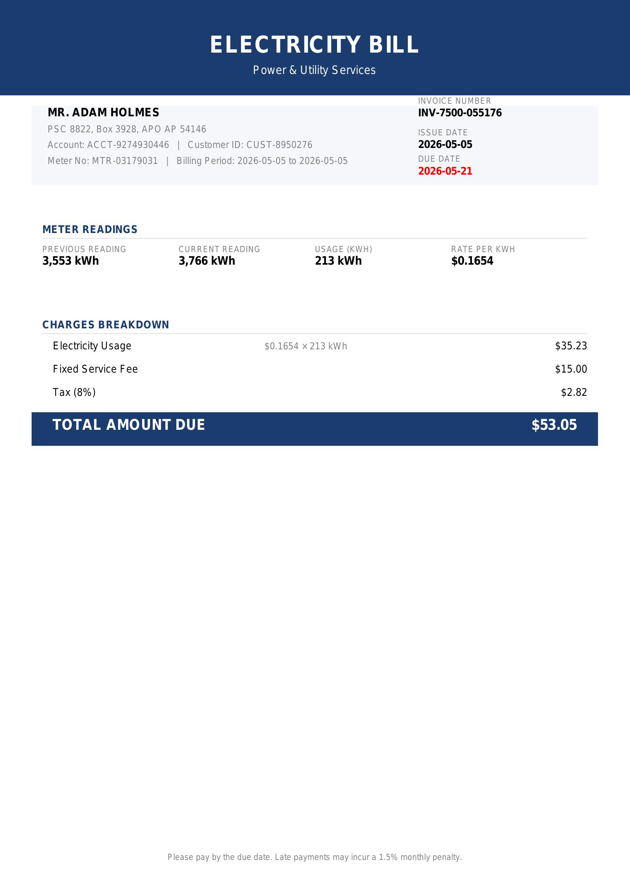

# Production-Ready OCR & Document Understanding Mastery Challenge [PDF](Production-Ready_OCR__Document_Understanding_Mastery_Challenge.pdf)

## Abtracts

### Step 1: Environment Setup & OCR Fundamentals
- OCR: Image/PDF to text (Tesseract OCR, PaddleOCR…)
- Document Understanding: Image/PDF to structured data (JSON)
- Supported document types: invoice, ID card, driver license, passport, certificate
- Set up GCP project and create Hugging Face account

---

### Step 2: Schema Design [Step 2](NguyenNgocChien-Step2-Intern-OCR.MD)
- Design JSON schema for each document type 

---

### Step 3: Synthetic Data Generation
- Use Faker + ReportLab to generate dummy data
- Generate balanced datasets for:
  - driver_license
  - passport
  - ielts certificate
  - medicare card
  - Working with children
  - engery bill

## Use Augraphy

<!-- #### Sample Output

---

### Dataset
- Hugging Face Dataset:
[dummy-dataset-documents-ocr](https://huggingface.co/datasets/Chino-01/dummy-dataset-documents-ocr) -->

## Generate data
Having some generated sample data (passport + medicare card) at: [synthetic-doc-generator-data](https://github.com/NguyenNgocChien-01/synthetic-doc-generator/tree/main/dataset)

### Step 4-5-6: Classify - Choose model - Finetune

I don't used classtify model base. I'll combine both the classification and extraction steps into a single LLM model because this approach can reduce pipeline complexity.

The fine-tune process will be based on: [Fine-tune VLMs](https://aws.amazon.com/blogs/machine-learning/fine-tune-vlms-for-multipage-document-to-json-with-sagemaker-ai-and-swift/#:~:text=Developing%20an%20evaluation%20framework%20to,and%20deploy%20models%20at%20scale)

My notebook to fine-tune: [Note book](https://colab.research.google.com/drive/1TNgAs_IInByV5f4pLvdbI3YwLIsJbSRe#scrollTo=tP3LSL97N2wx)
My report: [Step4-5-6](OCR-Step4-5-6.md)